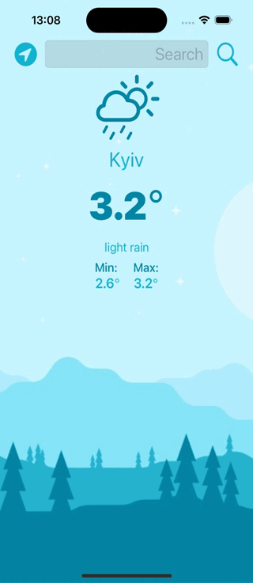

#  Clima Swift App

## What was do in this app

Beautiful, dark-mode enabled weather app. You'll be able to check the weather for the current location based on the GPS data from the iPhone as well as by searching for a city manually. Used Open Weather Map API to get weather data. 

## What was used to make this app

* The Swift Programming Language
* Storyboard
* Open Weather Map API
* Dark-mode enabled app
* Used the UITextField to get user input
* Used URLSession to network and make HTTP requests
* Parse JSON with the native Encodable and Decodable protocols
* Used Grand Central Dispatch to fetch the main thread
* Used Core Location to get the current location from the phone GPS

> [!NOTE]
> If use want to use your own API key, change constant **apiKey** in **WeatherManager.swift**

## Example what the application do

